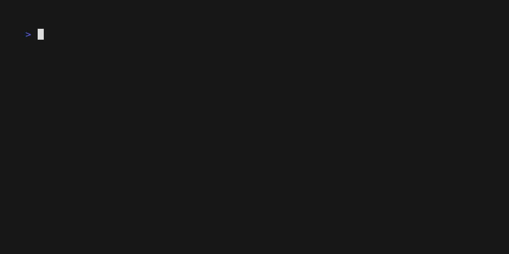
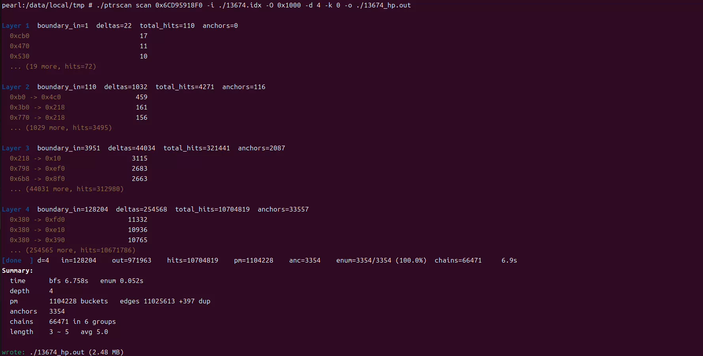

# ptrscan

[](https://en.wikipedia.org/wiki/C_(programming_language))
[](https://www.android.com/)
[](https://developer.android.com/ndk/guides/abis)
[](https://developer.android.com/ndk)
[](LICENSE)
[](https://github.com/kaidev/ptrscan/releases)
[](https://github.com/kaidev/ptrscan)

A fast in-process pointer-chain scanner for Android (arm64-v8a):



Example output:



It searches a target process for pointer chains leading to a given address,
using a compact in-memory index of every valid pointer slot in the process
image.

## Features

- Single-pass memory scan into a sorted index (IDX), with parallel radix sort.
- Persistent IDX files: build once, query many times.
- Reverse BFS with per-node top-K pruning to bound memory.
- Per-layer offset whitelist (`-t`) for precise tail constraints.
- Realtime progress bar and per-layer delta histogram (`-L`).
- Cross-run analysis (`analyze`): shared tails and full chain intersection.
- Reads and writes chains from `.txt` and `.pcf`.
- Cooperative cancellation via `SIGINT` during index build and scan.

## Build

Requires the Android NDK.

```sh
ndk-build
```

The binary lands in `libs/arm64-v8a/ptrscan`.

Push and run on a device or emulator:

```sh
adb push libs/arm64-v8a/ptrscan /data/local/tmp/
adb shell /data/local/tmp/ptrscan --help
```

Root is required to read another process's memory via `process_vm_readv`.

## Usage

```
ptrscan <COMMAND> [ARGS]

Commands:
  index    Build a pointer index from a running process and save to IDX
  scan     Build index on the fly (or load from IDX) and scan pointer chains
  analyze  Intersect chains / find shared tails across multiple scan outputs
  help     Print this message or the help of a given subcommand

Options:
  -h, --help     Print help
  -V, --version  Print version
```

### index

Build an IDX snapshot of the target process.

```sh
ptrscan index <PID> [-o FILE] [-j N]
```

- `-o, --output FILE` — write IDX to FILE (optional; without it the index
  is only reported, not saved).
- `-j, --jobs N` — worker threads (default: number of CPUs).

Example:

```sh
ptrscan index 5160 -o 5160.idx
```

### scan

```sh
ptrscan scan <PID> <TARGET> [FLAGS]
ptrscan scan <TARGET> -p <PID> [FLAGS]
ptrscan scan <TARGET> -i <FILE.idx> [FLAGS]
```

Three equivalent ways to specify the process: positional `<PID>`, `-p/--pid`,
or an IDX file via `-i/--idx` (no live process needed).

Flags:

| Flag | Description |
|------|-------------|
| `-p, --pid N`         | Target PID |
| `-i, --idx FILE`      | Load IDX from FILE instead of building from PID |
| `-d, --depth N`       | Max pointer depth (default 6, 0 = unlimited) |
| `-m, --min-depth N`   | Min pointer depth |
| `-n, --max-chains N`  | Stop after N chains |
| `-j, --jobs N`        | Worker threads (index build only) |
| `-k, --max-targets L` | Per-layer cap on retained targets, comma list |
| `-O, --offset N`      | Pointer search window per layer (default 0x1000) |
| `-t, --tail LIST`     | Per-layer tail offset whitelist, one `-t` per layer |
| `-L, --log FILE`      | Write the full per-layer delta histogram to FILE |
| `-o, --output FILE`   | Write chains to FILE (`.txt` or `.pcf`) |

Examples:

```sh
# Live process, build index on the fly
ptrscan scan 5160 0x7f2e4a0012a0 -d 6 -k 3 -o chains.txt

# Reuse a saved index, no live process needed
ptrscan scan 0x7f2e4a0012a0 -i 5160.idx -d 6 -k 3 -o chains.txt

# Constrain the first three layers to known offsets
ptrscan scan 0x7f2e4a0012a0 -i 5160.idx \
    -t 0x45c -t 0x110,0x118 -t 0x2b0 \
    -o chains.pcf
```

### analyze

Compare two or more scan outputs.

```sh
ptrscan analyze --tail         <f1> <f2> [...] [-o OUT]
ptrscan analyze --intersection <f1> <f2> [...] [-o OUT]
```

- `--tail`, `--shared-tail` — for each module/segment group, report the
  longest offset suffix present in every input file, and print it as a
  ready-to-paste `-t` command line.
- `--intersection`, `--intersect` — emit only chains that appear in every
  input file. Output is a normal `pc_list`, written as `.txt` or `.pcf`.
- `-o, --output FILE` — where to write the intersection result. Without it,
  the result is printed to stdout.

Inputs can be `.txt` or `.pcf`; the format is chosen by extension.

Examples:

```sh
ptrscan analyze --tail a.txt b.txt c.txt
ptrscan analyze --intersection a.txt b.txt c.txt -o common.pcf
```

### help

```sh
ptrscan help            # same as --help
ptrscan help scan       # per-subcommand help
ptrscan help analyze
```

### Parameters in detail

**`-k / --max-targets`**

Per-layer cap on how many targets are kept for each parent slot. This is the
main defense against exponential blow-up.

- Comma-separated list, e.g. `-k 0,0,128,64,32,16,8`.
- Layer mapping (1-based, matching the `Layer N` shown in progress output):
  - `idx[0]` — unused
  - `idx[1]` — Layer 1 (slots that directly point to the target)
  - `idx[2]` — Layer 2
  - ...
- A single value applies to every layer: `-k 3`.
- `0` means unlimited (not recommended for deep scans).

**`-t / --tail`**

One `-t` per layer, ordered from nearest to farthest from the target
(so the first `-t` constrains Layer 1). Comma-separated offsets apply to the
same layer.

```sh
-t 0x45c -t 0x110,0x118,0x130 -t 0x2b0
```

A candidate edge is kept only if its delta matches one of the offsets for
that layer. Any layer without a `-t` is unconstrained.

**`-O / --offset`**

Size of the value window scanned below each target: a slot `P` is a hit if
`P.value ∈ [T - offset, T]`.

## Output format

`.txt` — human-readable. Header comments, then a group per module/segment
with indented offset chains.

```
# ptrscan
# groups: 1 chains: 2

/path/to/libgame.so .data[0]
  0x45c->0x110->0x2b0
  0x45c->0x118->0x2b0
```

`.pcf` — binary with super block, CRC32 over header and file, grouped chains.
Selected by file extension; any other extension (or none) uses `.txt`.

## Progress

During scan, stderr shows a one-line status:

```
pearl:/data/local/tmp # ./ptrscan scan 0x6CD95918F0 -i ./13674.idx -O 0x1000 -d 4 -k 0 -o ./13674_hp.out

Layer 1  boundary_in=1  deltas=22  total_hits=110  anchors=0
  0xcb0                            17
  0x470                            11
  0x530                            10
  ... (19 more, hits=72)

Layer 2  boundary_in=110  deltas=1032  total_hits=4271  anchors=116
  0xb0 -> 0x4c0                   459
  0x3b0 -> 0x218                  161
  0x770 -> 0x218                  156
  ... (1029 more, hits=3495)

Layer 3  boundary_in=3951  deltas=44034  total_hits=321441  anchors=2087
  0x218 -> 0x10                  3115
  0x798 -> 0xef0                 2683
  0x6b8 -> 0x8f0                 2663
  ... (44031 more, hits=312980)

Layer 4  boundary_in=128204  deltas=254568  total_hits=10704819  anchors=33557
  0x380 -> 0xfd0                11332
  0x380 -> 0xe10                10936
  0x380 -> 0x390                10765
  ... (254565 more, hits=10671786)
[done  ] d=4   in=128204    out=971963    hits=10704819    pm=1104228    anc=3354    enum=3354/3354 (100.0%)  chains=66471     6.9s
Summary:
  time      bfs 6.758s   enum 0.052s
  depth     4
  pm        1104228 buckets   edges 11025613 +397 dup
  anchors   3354
  chains    66471 in 6 groups
  length    3 ~ 5   avg 5.0

wrote: ./13674_hp.out (2.48 MB)
```

Fields: phase (`bfs` / `enum`), current depth, nodes entering the layer,
next-layer size, hits after pruning, parent-map size, anchors found, chains
emitted, elapsed time.

If `-L/--log FILE` is given, the full per-layer delta histogram (with anchor
counts) is appended to FILE as each layer finishes.

## Design notes

- **Index (IDX).** A snapshot of every 8-byte-aligned pointer-sized value in
  the process that lies within a mapped segment. Stored as
  `(value, segment | slot)` pairs, sorted by value for O(log n) window queries.
- **Parent map.** During BFS, each new parent slot is stored once with a small
  list of targets it points to. Enumeration later walks this map from anchors
  back to the target.
- **Bounded memory.** Per-node target cap, global visited set, edge dedup, and
  the search window together bound the working set to `O(K · unique_slots)`
  regardless of depth.
- **Progress and cancellation.** Progress is a lock-protected snapshot of the
  scan state; `SIGINT` cancels both index build and scan cleanly, and the
  partial result is returned rather than discarded.

## License

Two licenses apply depending on the file:

- `fs_ptrscan.h`, `fs_ptrscan.c` — Apache License, Version 2.0.
  See [LICENSE](LICENSE) for the full text.
- `ptrscan.c` (CLI frontend) — MIT License.
  See the file header for the full text.

Check the header of each source file for the exact terms.

---